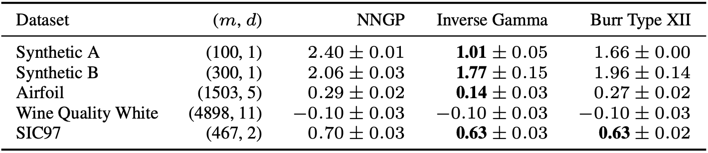

# Scale Mixtures of Neural Network Gaussian Processes

## Requirements

```bash
pip install -r requirements.txt
```

## Sampling

### Available part

- initial
- last
- full

### Usage

```bash
python eval.py sample -h
```

```bash
python eval.py sample <part> \
               -a <alpha> \
               -b <beta> \
               -so <sample-output> \
               -fo <figure-output>
```

### Example

```bash
python eval.py sample full \
               -a 2. \
               -b 3. \
               -so samples/full-2.0-3.0.npy \
               -fo samples/full-2.0-3.0-20.png
```

## Regression

### Available datasets

- boston
- concrete
- energy
- kin8nm
- naval
- plant
- wine-red
- wine-white
- yacht
- airfoil
- sic97
- syn-normal
- syn-t

#### Usage

```bash
python eval.py reg -h
```

```bash
python eval.py reg <dataset> \
               # Common options
               -nh <number-of-hiddens> \
               -wv <w-variance> \
               -bv <b-variance> \
               -act <activation> \
               -e <epsilon-log-variance> \
               -g <gpu-number (cpu=-1)> \
               -s <seed> \
               # NNGP options
               [-lv <last-layer-variance>] \
               # Inverse Gamma options
               [-a <alpha (number or list)>] \
               [-b <beta (number or list)>] \
               # Burr Type XII options
               [-bc <burr_c (number or list)>] \
               [-bd <burr_d (number or list)>]
```

### Example

```bash
python eval.py reg boston \
               # Common options
               -nh 16 \
               -wv 4. \
               -bv 0. \
               -act erf \
               -e 5. \
               -g 0 \
               -s 10 \
               # NNGP options
               -lv 1. \
               # Inverse Gamma options
               -a "[1., 2., 4.]" \
               -b 1. \
               # Burr Type XII options
               -bc 2. \
               -bd "range(1, 4)"
```

### Results




## Classification

### Available datasets

- mnist
- mnist_corrupted/shot_noise
- mnist_corrupted/impulse_noise
- mnist_corrupted/spatte
- mnist_corrupted/glass_blur
- mnist_corrupted/zigzag
- emnist
- kmnist
- fashion_mnist
- svhn_cropped

### Usage

```bash
python eval.py cls -h
```

```bash
python eval.py cls <dataset> [<test-dataset>] \
              # Common options
              -nh <number-of-hiddens> \
              -wv <w-variance> \
              -bv <b-variance> \
              -act <activation> \
              -e <epsilon-log-variance> \
              -g <gpu-number (cpu=-1)> \
              -s <seed> \
              # NNGP options
              [-lv <last-layer-variance>] \
              # Inverse Gamma options
              [-a <alpha (number or list)>] \
              [-b <beta (number or list)>] \
              # Burr Type XII options
              [-bc <burr_c (number or list)>] \
              ]-bd <burr_d (number or list)>]
```

### Example

```bash
python eval.py cls mnist mnist_corrupted/shot_noise \
              # Common options
              -nh 16 \
              -wv 8. \
              -bv 1. \
              -act relu \
              -e 6. \
              -g -1 \
              -s 109 \
              # NNGP options
              -lv 1. \
              # Inverse Gamma options
              -a "[0.5, 1., 4.]" \
              -b "[1., 2.]" \
              # Burr Type XII options
              -bc "range(1, 3)" \
              -bd 2.
```

### Results


